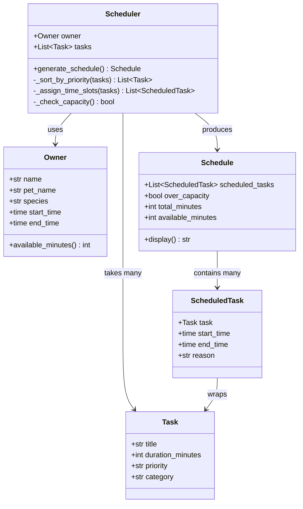

# PawPal+ UML Class Diagram

```mermaid
classDiagram
    class Task {
        +str title
        +int duration_minutes
        +str priority
        +str category
    }

    class Owner {
        +str name
        +str pet_name
        +str species
        +time start_time
        +time end_time
        +available_minutes() int
    }

    class ScheduledTask {
        +Task task
        +time start_time
        +time end_time
        +str reason
    }

    class Schedule {
        +List~ScheduledTask~ scheduled_tasks
        +bool over_capacity
        +int total_minutes
        +int available_minutes
        +display() str
    }

    class Scheduler {
        +Owner owner
        +List~Task~ tasks
        +generate_schedule() Schedule
        -_sort_by_priority(tasks) List~Task~
        -_assign_time_slots(tasks) List~ScheduledTask~
        -_check_capacity() bool
    }

    Scheduler --> Owner : uses
    Scheduler --> Task : takes many
    Scheduler --> Schedule : produces
    Schedule --> ScheduledTask : contains many
    ScheduledTask --> Task : wraps
```
